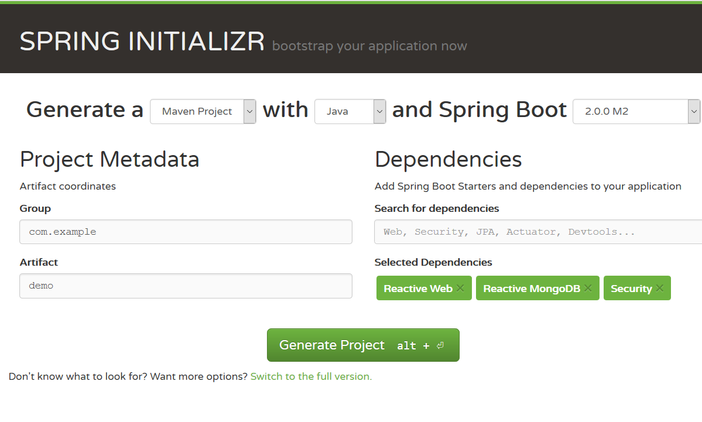

# Create a WebFlux application with Spring Boot

Spring Boot 4.x targets the latest Spring technology stack, including Spring Framework 7, Spring Security 6+, Spring Session 3+, and more.

Spring Boot added a new starter `spring-boot-starter-webflux` for starting a WebFlux application.

## Generate project skeleton

Follow the following steps to prepare the project skeleton using [Spring initializr](http://start.spring.io).

Open your browser and navigate to [http://start.spring.io](http://start.spring.io).



In the Spring Boot Initializr page, fill the following fields.

1. Select the latest Spring Boot 4.x release (for example, 4.0.0).
2. In the dependencies box, type **reactive** and choose **Reactive Web** to add `spring-boot-starter-webflux`. Optionally add Lombok, Reactive MongoDB, Reactive Redis, or other starters you need.
3. Click **Generate project** (or press **ALT+ENTER**) to download a ZIP archive containing the project skeleton.

Download the archive and extract files into your disc, import the source codes into your IDEs.

Open the pom.xml, you will see the `spring-boot-starter-webflux` is added into _dependencies_.

```xml
<dependency>
	<groupId>org.springframework.boot</groupId>
	<artifactId>spring-boot-starter-webflux</artifactId>
</dependency>
```

And a `spring-boot-maven-plugin` is added in the initial pom.xml.

Spring Boot starter `spring-boot-starter-webflux` will handle the `spring-webflux` related dependencies and enable WebFlux support automatically. It also add `logback` as default logging handler.

Compare to the former vanilla version,

1. No need explicit `WebConfig`, Spring Boot configures it automatically.
2. The former bootstraping class or `AppInitializer` is no use now, the Spring Boot built-in `@SpringBootApplication` annotated class hands over the applicationContext lifecyle and application bootstrap.

```java
@SpringBootApplication
public class DemoApplication {

    public static void main(String[] args) {
        SpringApplication.run(DemoApplication.class, args);
    }
}
```

By default, Spring Boot will use Reactor Netty as runtime to run a WebFlux application. No need extra configuration for it.

To start the application in your terminal, run the following command in the project root folder.

```
mvn spring-boot:run
```

Alternatively, to start Spring Boot applications in your IDEs, run it just like running a general-purpose Java application.

## Getting Started

As an exercise, try to add the similar codes with [the former post](./first.md) to expose RESTful APIs for `Post`.

1. Add a POJO `Post`.
2. Add a dummy `PostRepository`.
3. Add a simple `PostController`.

Restart the application, and test the endpoints.

```bash
#curl http://localhost:8080/posts
...
```

Check the complete codes, [spring-reactive-sample/boot](https://github.com/hantsy/spring-reactive-sample/tree/master/boot-start).

## Bootstrap

By default, when `spring-boot-starter-webflux` is included in the classpath, it uses Netty as the embedded server to serve HTTP requests.

It is easy to switch to other embedded servers.

### Apache Tomcat

If you want to use Apache Tomcat as target runtime environment, just exclude `spring-boot-starter-reactor-netty` from `spring-boot-starter-webflux`, and add an extra dependency `spring-boot-starter-tomcat` into _pom.xml_.

```xml
<dependency>
	<groupId>org.springframework.boot</groupId>
	<artifactId>spring-boot-starter-webflux</artifactId>
	 <exclusions>
		<exclusion>
			<artifactId>spring-boot-starter-reactor-netty</artifactId>
			<groupId>org.springframework.boot</groupId>
		</exclusion>
	</exclusions>
</dependency>

<dependency>
	<groupId>org.springframework.boot</groupId>
	<artifactId>spring-boot-starter-tomcat</artifactId>
</dependency>
```

Check the sample codes, [spring-reactive-sample/boot-tomcat](https://github.com/hantsy/spring-reactive-sample/tree/master/boot-tomcat).

### Eclipse Jetty

To use Jetty to replace the default Reactor Netty.

```xml
<dependency>
  <groupId>org.springframework.boot</groupId>
  <artifactId>spring-boot-starter-webflux</artifactId>
  <exclusions>
    <exclusion>
      <groupId>org.springframework.boot</groupId>
      <artifactId>spring-boot-starter-reactor-netty</artifactId>
    </exclusion>
  </exclusions>
</dependency>

<dependency>
  <groupId>org.springframework.boot</groupId>
  <artifactId>spring-boot-starter-jetty</artifactId>
</dependency>
```

Check the sample codes, [spring-reactive-sample/boot-jetty](https://github.com/hantsy/spring-reactive-sample/tree/master/boot-jetty).

### Undertow (deprecated)

You can use Undertow as the runtime, but note that Undertow examples in this repository are retained for historical reference and are marked deprecated. For new projects prefer Reactor Netty or Jetty.

```xml
<dependency>
	<groupId>org.springframework.boot</groupId>
	<artifactId>spring-boot-starter-webflux</artifactId>
	<exclusions>
		<exclusion>
			<artifactId>spring-boot-starter-reactor-netty</artifactId>
			<groupId>org.springframework.boot</groupId>
		</exclusion>
	</exclusions>
</dependency>

<dependency>
	<groupId>org.springframework.boot</groupId>
	<artifactId>spring-boot-starter-undertow</artifactId>
</dependency>
```

Check the sample codes, [spring-reactive-sample/boot-undertow](https://github.com/hantsy/spring-reactive-sample/tree/master/boot-undertow).
